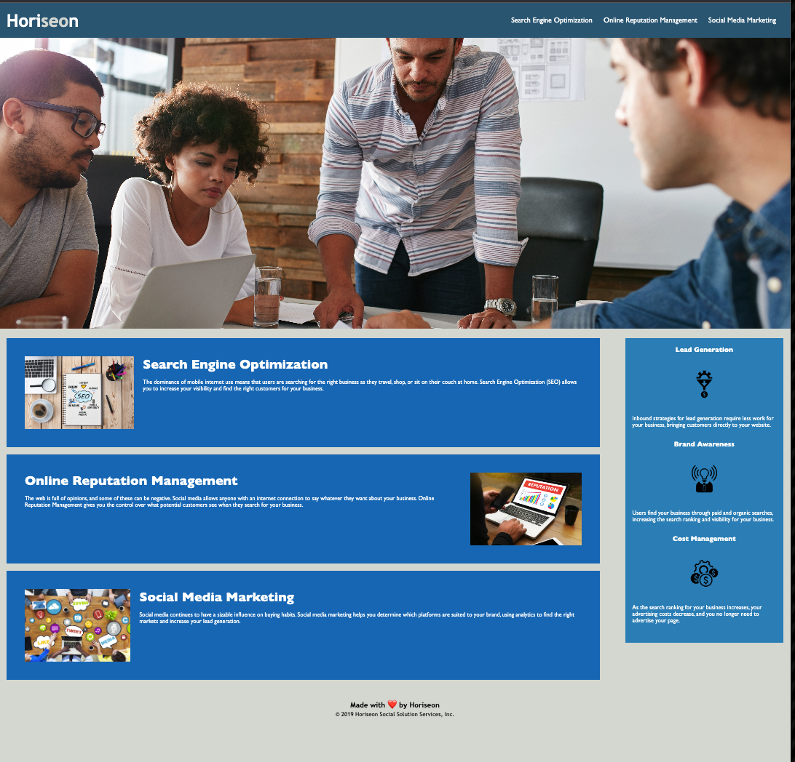

# My site is live at 
- https://shok1to.github.io/espresso/

## About

- Replaced all div elements with semantic elements

- Items are in logical order (CSS)

- Added alt attributes to images

- Heading elements (h1, h2, h3...) flow in sequential order down html page. 

- Added Title element that makes sense to the web page 

- Consolidate CSS

- Fixed broken link 

### Contributors
- Xandromus